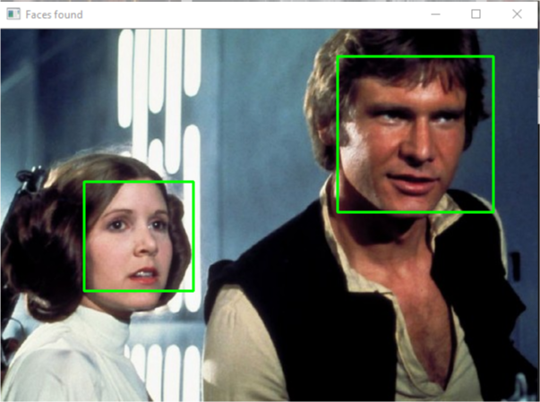

# Facedetect_Python
## Features
This project uses a prebaked model of Haarcascade classifier that helps to deduce the faces, particularly the face recognization is being shown in this repository. Further the model can also be implemented using such pretrained models, to detect other parts of human body like eyes, using the eyes-cascade classifier
## Application
Further development using the pretrained models can enable session caching using temporary face detection, which is unheard of in the industry, but has been successfully implemented in its closed source version. The impact this project has on the society is impeccable and the future of websites will surely embibe more such authentication technologies to reduce spam and make sessional caching more efficient.
## Usage
 python facedect.py
## Demo:

